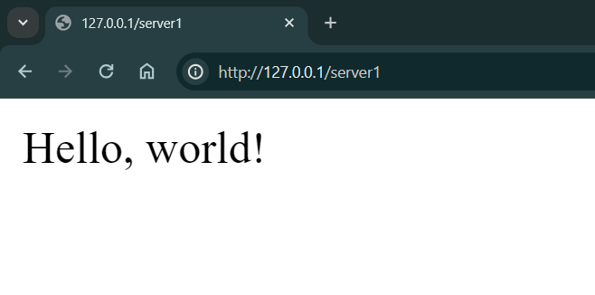
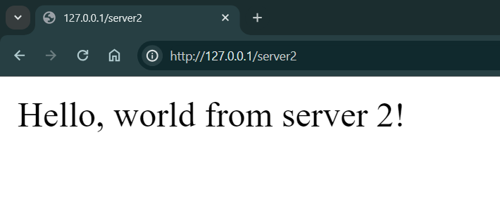
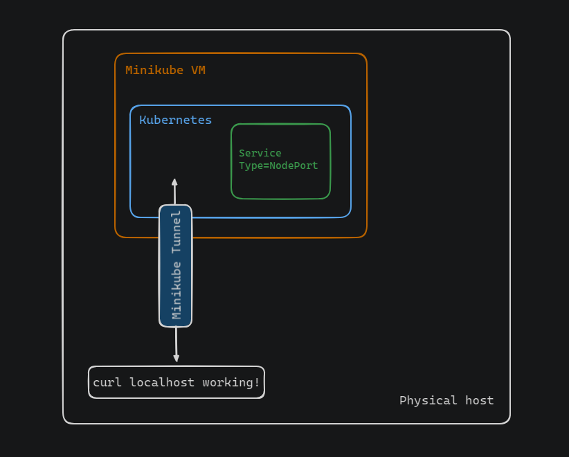

# Setting up Nginx Ingress in Minikube Cluster

This document provides information about the set up of an Nginx Ingress in a Minikube Kubernetes cluster to route traffic based on different paths to different backend services running in pods.

Here is a diagram to demonstrate the task:


In the "Menifest" directory we have all the required files to setup the nginx ingress. The `deployment1.yaml` and `deployment2.yaml` definition are utilized to instantiate pods housing the server applications. The pods contain containers running Node.js Express servers, which are configured to run on ports 3001 and 3002.

The `svc1.yaml` and `svc2.yaml` creates service for the servers that are of type ClusterIP, ensuring accessibility for the ingress within the cluster. 

Then, the `nginx-deploy.yaml` creates a deployment for the nginx-ingess with 1 replica. The `nginx-svc.yaml` creates a nodePort service as we need a service to expose the ingress controller to the external world.

Now on to the next part, of creating Ingress Resources, we configured rules to route traffic to different applications based on the URL path. Run the `ingress-resource.yaml` to set the ingress resource configuration.


## Setup Procedure

1. This steps assumes that you are using minikube to run a local Kubernetes cluster. Visit [Install tools](https://kubernetes.io/docs/tasks/tools/#minikube) to learn how to install minikube.

2. If you haven't already set up a cluster locally, run:
    ```
    minikube start
    ``` 
    to create a cluster.

3. Now from the 'Menifest' directory create all the deployment, services, configMap, and ingress resources using the yaml file. To create these k8s objects use the command: 
  
    ```
    kubectl create -f <menifest-file-name>
    ``` 

    After creating all the objects run: 

    ```
    kubectl get all
    ``` 

    to see all created objects. The output should be similar to:
    
    

4.  Then we used:
    ```
    minikube tunnel
    ```
    command to access the     ingress. Onece the tunnel is created we can open browser and visit:
    `http://127.0.0.1/server1` and `http://127.0.0.1/server2`.
    The nginx-ingress will redirect to the corresponding server according to the url path.  

    The output should be similar to:

    

    
    
##  Ingree resources defiinition


An ingress Resource is a set of rules and configurations applied on the ingress controller. We can configure rules to say, simply forward all incoming traffic to a single application, or route traffic to different applications based on the URL.


Now, here is the ingree resources defiinition file:
```
apiVersion: networking.k8s.io/v1
kind: Ingress
metadata:
  name: minimal-ingress
  annotations:
    nginx.ingress.kubernetes.io/rewrite-target: /
spec:
  rules:
  - http:
      paths:
      - path: /server1
        pathType: Prefix
        backend:
          service:
            name: server1-service
            port:
              number: 3001
      - path: /server2
        pathType: Prefix
        backend:
          service:
            name: server2-service
            port:
              number: 3002
```


This YAML configuration defines an Ingress resource named "minimal-ingress" for routing HTTP traffic within a Kubernetes cluster. It specifies rules to direct requests with specific paths to corresponding backend services. Requests with a path prefix of "/server1" are directed to a backend service named "server1-service" running on port 3001. Similarly, requests with a path prefix of "/server2" are routed to a backend service named "server2-service" running on port 3002.


## How minikube tunnel works

