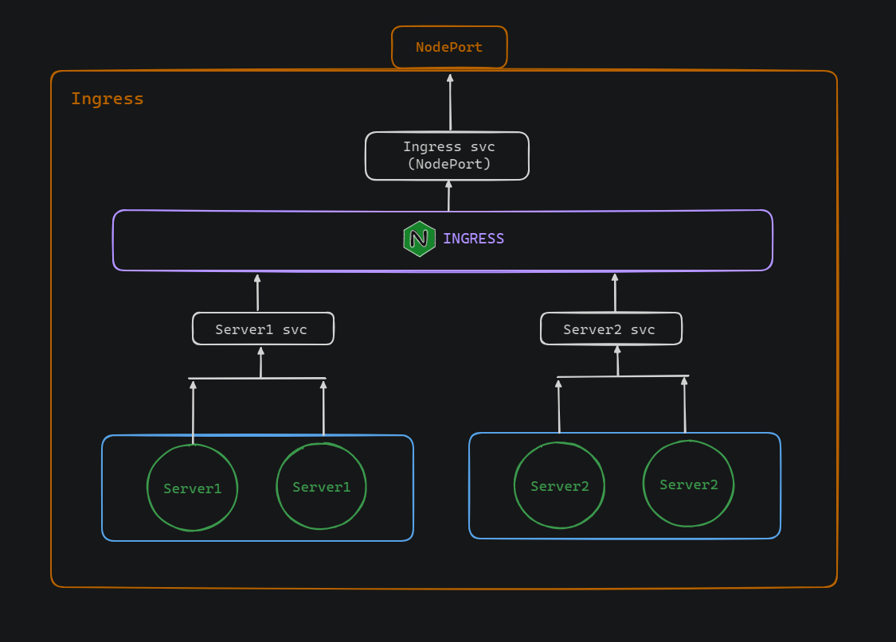
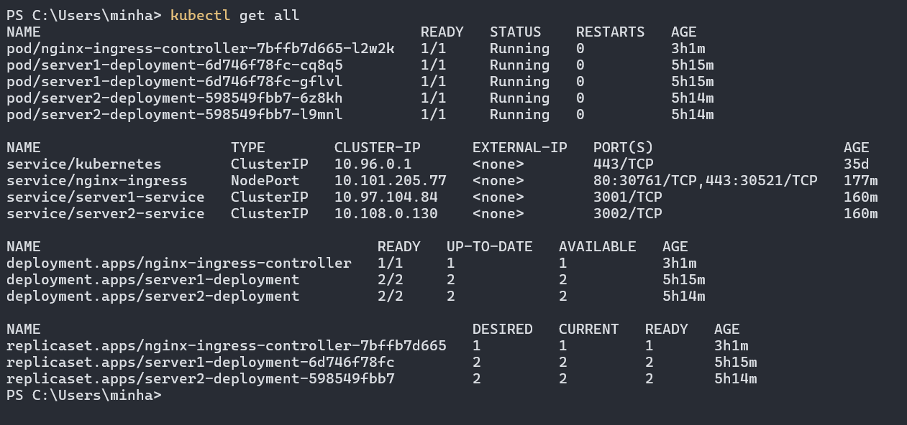

# Setting up Nginx Ingress in Minikube Cluster

This document provides information about the set up of an Nginx Ingress in a Minikube Kubernetes cluster to route traffic based on different paths to different backend services running in pods.

Here is a diagram to demonstrate the task:


In the following image we can see information about all resources in the currently active namespace. Here we used the `kubectl get all` command. This output provides information about pods, services, deployments, and replicasets



The `server1-deployment` and `server2-deployment` are utilized to instantiate pods housing the server applications. The `server1-service` and `server2-service` are of type ClusterIP, ensuring accessibility for the ingress within the cluster. On the other hand, the `nginx-ingress` service is of type NodePort, facilitating external access to it from outside the cluster.

The pods contain containers running Node.js Express servers, which are configured to run on ports 3001 and 3002.


Now, here is the ingree resources defiinition file:

```
apiVersion: networking.k8s.io/v1
kind: Ingress
metadata:
  name: minimal-ingress
  annotations:
    nginx.ingress.kubernetes.io/rewrite-target: /
spec:
  rules:
  - http:
      paths:
      - path: /server1
        pathType: Prefix
        backend:
          service:
            name: server1-service
            port:
              number: 3001
      - path: /server2
        pathType: Prefix
        backend:
          service:
            name: server2-service
            port:
              number: 3002
```


This YAML configuration defines an Ingress resource named "minimal-ingress" for routing HTTP traffic within a Kubernetes cluster. It specifies rules to direct requests with specific paths to corresponding backend services. Requests with a path prefix of "/server1" are directed to a backend service named "server1-service" running on port 3001. Similarly, requests with a path prefix of "/server2" are routed to a backend service named "server2-service" running on port 3002.